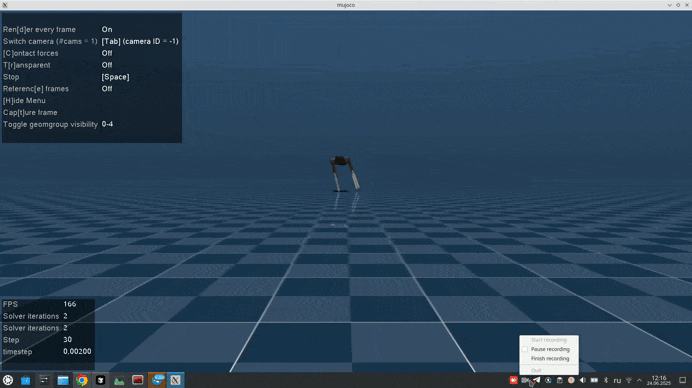

# robot_programming_cource_parallel_learning

## О проекте

Данный проект посвящён обучению и анализу поведения агентов с подкреплением (Reinforcement Learning, RL) для управления четырёхногим роботом в симуляционной среде MuJoCo (на примере модели Ant-v5, адаптированной под робота Aliengo). В проекте реализованы инструменты для параллельного обучения агентов с использованием современных RL-алгоритмов (SAC, PPO, DQN и др.), кастомизации функции вознаграждения, автоматической оценки и визуализации результатов. Проект позволяет проводить эксперименты с различными гиперпараметрами, сравнивать производительность агентов и анализировать их поведение как в процессе обучения, так и после него.

## Содержание

- [Описание файлов](#описание-файлов)
- [Визуализация процесса обучения](#Визуализация-процесса-обучения)

## Описание файлов

**Папка `src/` содержит основные скрипты проекта:**

- `bench.py` — скрипт для запуска одиночного эксперимента обучения RL-агента. Позволяет выбрать алгоритм (DQN, PPO, SAC, TD3, A2C) и среду (по умолчанию CartPole-v1 или кастомная go1). Использует Monitor и RescaleActionV0 для корректной работы с логами и масштабированием действий. Поддерживает сохранение результатов, логов и автоматическую оценку агента с помощью EvalCallback. Предназначен для быстрого тестирования и бенчмаркинга различных RL-алгоритмов на выбранной задаче.

- `my_eval.py` — модифицированный колбэк `EvalCallback` из Stable Baselines3, расширенный поддержкой установки seed для воспроизводимости результатов. Используется для периодической оценки агента во время обучения: вычисляет среднюю награду, длину эпизода, успехи, сохраняет лучшие модели и статистику нормализации среды (VecNormalize). Позволяет гибко логировать результаты и интегрируется с другими колбэками.

- `parallel_train.py` — основной скрипт для параллельного обучения RL-агента с использованием нескольких сред (SubprocVecEnv). Позволяет запускать обучение сразу в нескольких копиях среды для ускорения сбора опыта. Поддерживает загрузку и сохранение моделей, автоматическую нормализацию наблюдений и наград (VecNormalize), чекпоинты, автоматическую оценку (EvalCallback), продолжение обучения с предыдущих запусков. Все параметры (алгоритм, количество сред, размер буфера, batch size, ID запуска и др.) задаются через аргументы командной строки.

- `plot_go1.py` — скрипт для визуализации результатов обучения. Загружает сохранённые файлы с результатами (npz) и строит графики зависимости средней награды и длины эпизода от количества шагов для выбранных запусков и алгоритмов. Позволяет сравнивать производительность разных агентов, сохраняет графики в формате PNG и EPS. Используется для анализа качества обучения и подбора гиперпараметров.

- `render_model.py` — скрипт для визуализации поведения обученного агента в среде. Загружает сохранённую модель и статистику нормализации, создаёт среду с рендерингом (визуализацией), запускает агента в режиме inference и отображает его действия в реальном времени. Позволяет убедиться в качестве и адекватности поведения агента после обучения.

- `reward_wrappers.py` — содержит кастомный враппер среды `Go1RewardWrapper`, который модифицирует функцию вознаграждения для задачи с четырёхногим роботом. Добавляет компоненты награды за ориентацию корпуса (стимулирует держать корпус ровно) и за движение в суставах (поощряет активную походку). Позволяет формировать более сложное и осмысленное поведение агента, чем стандартная функция вознаграждения среды.

## Визуализация процесса обучения

**Движение вперёд**

**Движение вбок**

